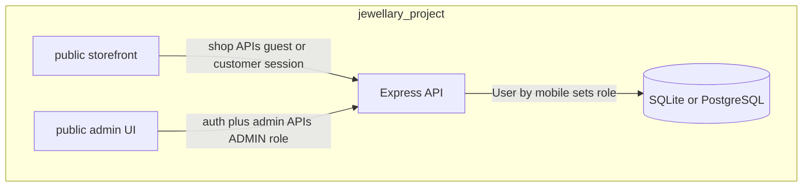
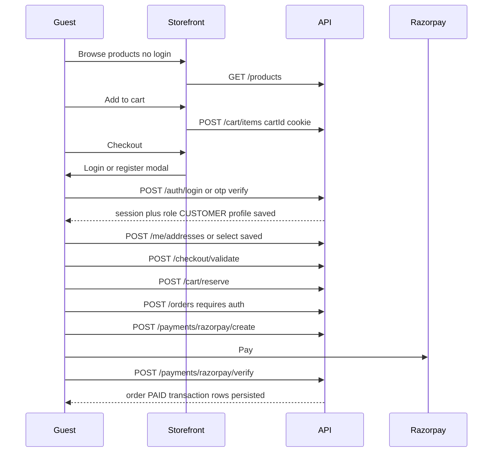
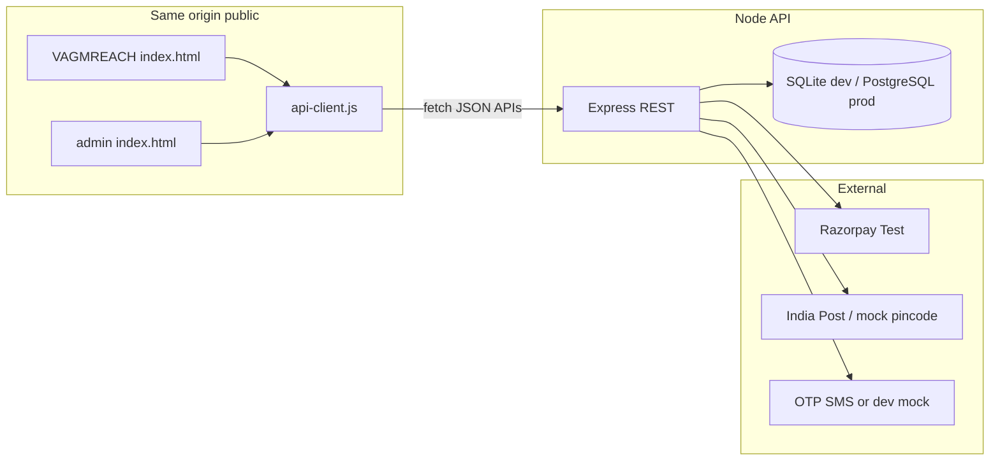
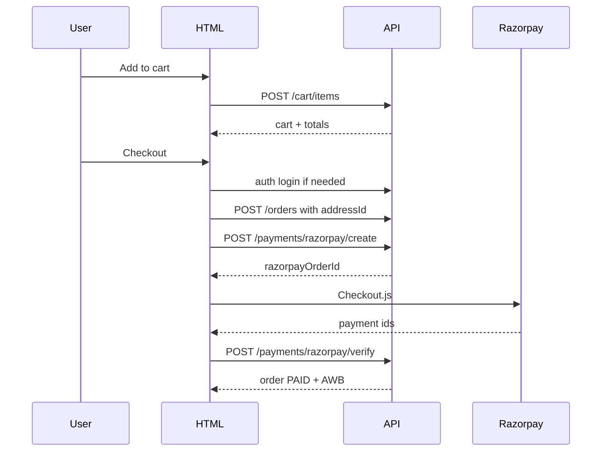
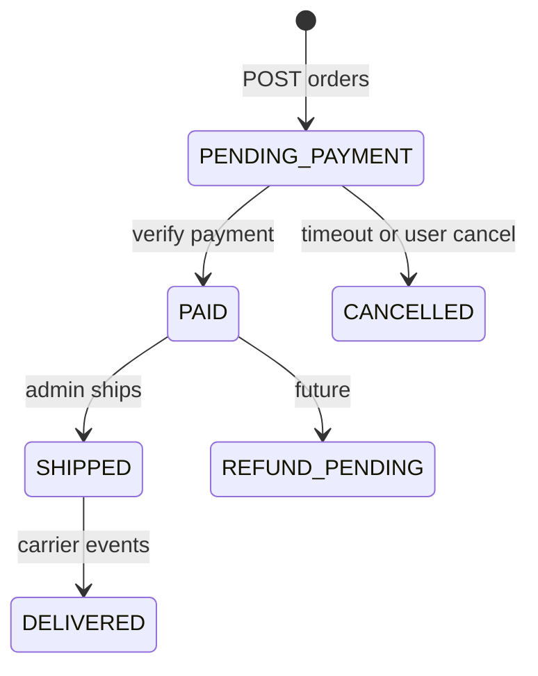

# VAGMREACH Amazon-Style Ecommerce Plan

Customers never upload products — they only shop on the storefront. Staff manage catalog and orders in an **admin area in the same project**. One Node API and one Prisma database serve both.

**Project:** `jewellary_project` (single repo) — `public/` (storefront + admin UI), `server/` (API + DB). **Roles are assigned on the backend** per **mobile number** (`CUSTOMER` or `ADMIN` on the `User` record). Login is **mobile + password** or **mobile + OTP**; the API returns the user’s role from the database (clients do not choose or send role).

**How to use this document:** Treat this as the **single development spec**. Implementation should follow the flows, API contracts, data model, state machines, and edge-case tables below so engineers (or agents) can build without ad-hoc product decisions.

### Product rules (summary)

| Actor | Rule |
|-------|------|
| **Guest customer** | May browse catalog and use cart **without login**. |
| **Customer at purchase** | **Login or register required** before address confirmation, order creation, and payment (checkout gate). |
| **Customer profile** | On login/register, **persist user + profile** in DB; link future orders and addresses to `userId`. |
| **Addresses** | Logged-in customers can **save, edit, delete, and select** delivery addresses; checkout uses a selected address (snapshot copied onto the order). |
| **Transactions** | Every purchase stores **full order, line items, address snapshot, payment record, and shipment** tied to `userId`. |
| **Admin** | Stored in DB as `User` with **`role = ADMIN`** (seeded; not self-service). Manages products/orders; **same page** shows **customer-facing preview** while editing a product. May **upload photos and videos** for each jewelry SKU; saved media is tied to that **`productId`**. |
| **Product media (customer view)** | Any **photo or video** the admin uploads for a product is served on the **storefront** for that same SKU: grid card (primary image + optional video badge), **product detail** (gallery + inline video), and the admin **live preview** panel — same assets and order as customers see after save (and within ~30s catalog poll for list views). |
| **Catalog visibility** | Public `GET /products` returns only **`isActive = true`** (plan also mentions hiding `stock = 0` — **not filtered in API yet**; UI may still show out-of-stock). |

### Implementation status (as built)

| Area | Status | Notes |
|------|--------|--------|
| Shop API (A–E) | **Done** | Cart, shipping, orders, Razorpay/COD, tracking, activity |
| Auth + roles (G) | **Done** | Session cookie `vgm_session`; password + OTP (dev OTP in `.env`) |
| Addresses + `/me/orders` API | **Done** | Full CRUD addresses; order history API |
| Admin API (G) | **Done** | Products CRUD, orders read/update, `PATCH /admin/shipments/:id` |
| Storefront UX (H) | **Done** | Checkout login gate; account modal (orders + addresses); catalog poll **30s** |
| Admin UI (H) | **Done** | Create/edit/deactivate products; order detail; status + AWB/tracking |
| Shared product UI | **Done** | [`product-renderer.js`](../public/assets/js/product-renderer.js) `renderStorefrontCard` |
| Product photos & videos (admin → customer) | **Done** | `ProductMedia`; multipart upload; shop gallery modal; limits 5MB/photo, 50MB video |
| Storefront header login | **Done** | Login / My account / Log out; **no staff link** on customer site |
| Responsive modals (checkout + gallery) | **Done** | `92dvh` panels, internal scroll, body lock |
| Docs (F) | **Mostly done** | [`API.md`](API.md) + [`openapi.ts`](../server/src/openapi.ts) include auth/admin/me |
| Root README | **Done** | [`README.md`](../README.md) |
| Edge cases doc + smoke tests | **Done** | [`EDGE_CASES.md`](EDGE_CASES.md); `npm run test:smoke` |
| Razorpay webhook (G.1) | **Not done** | `POST /webhooks/razorpay` |
| Production SMS OTP | **Not done** | Dev: `OTP_DEV_MODE` + `OTP_DEV_CODE` |
| Catalog without re-seed (I) | **Partial** | Admin owns day-to-day catalog; `db seed` still resets dev data |

**Dev accounts** ([`server/seed/users.json`](../server/seed/users.json)): Admin `9999999999` / `admin123`; Customer `9888888888` / `customer123`.

**Run:** `cd server && npm run dev` → http://localhost:4000 (storefront), http://localhost:4000/admin. DB file: `server/prisma/dev.db` (inspect with `npx prisma studio`).

---

## Current state

Historical note: the original VAGMREACH page was client-only HTML with in-memory `PRODUCTS`; the stack below is the source of truth.

### Customer storefront (`public/`)

Implemented: [`index.html`](../public/index.html), [`storefront.js`](../public/assets/js/storefront.js), [`api-client.js`](../public/assets/js/api-client.js), [`product-renderer.js`](../public/assets/js/product-renderer.js).

| Area | Status | Notes |
|------|--------|--------|
| Catalog | **Done** | `GET /api/v1/products`; auto-refresh every 30s |
| Cart | **Done** | Guest `cartId`; merges on login |
| Auth at checkout | **Done** | Modal: password, register, OTP |
| Addresses | **Done** | Header **Addresses** → account modal; checkout saved list + save checkbox |
| Order history | **Done** | Header **My Orders** → `GET /me/orders` |
| Stock lock / shipping / pay | **Done** | As in phases A–E |
| Tracking / live activity | **Done** | Unchanged |

Initial catalog still **seeded** from [`server/seed/products.json`](../server/seed/products.json) on `db seed`; new SKUs added via admin persist in DB until next seed.

### Admin UI (`public/admin/`)

**Implemented:** [`public/admin/index.html`](../public/admin/index.html), [`admin.js`](../public/admin/assets/js/admin.js). Staff login (password + OTP); navy/gold branding + logo; product **create / edit / deactivate**; **multiple photos + one video** upload per SKU; **storefront-identical preview** + gallery panel; orders **list + detail**; **order status**; **shipment AWB/carrier + tracking event** when shipment exists.

### API (`server/`)

**Implemented:** Shop routes + [`auth.ts`](../server/src/routes/v1/auth.ts), [`me.ts`](../server/src/routes/v1/me.ts), [`admin/`](../server/src/routes/v1/admin/) (products, orders, shipments), middleware [`auth.ts`](../server/src/middleware/auth.ts) (`requireAuth`, `requireRole`).

---

## Roles and data flow



- **`User.mobile`** is unique; **`User.role`** is `CUSTOMER` or `ADMIN` (set in DB/seed, not by the client).
- Login (**password** or **OTP**) loads the user by mobile; session/JWT includes `role`; **`requireRole('ADMIN')`** protects `/api/v1/admin/*`.
- Admins **write** products (including **photo/video media** for each SKU) and **update** orders/shipments; the storefront **reads** catalog (with media URLs) and **creates** orders at checkout only.
- **Guests** hit shop + cart APIs; **authenticated customers** (`role = CUSTOMER`) required for `POST /orders`, payments, and saved addresses.
- Logistics/pincode remain **mock** until integrated; Razorpay remains **real test API** when keys are set.

---

## End-to-end journeys

### Customer journey (guest → purchase)



1. **Browse** — no auth; catalog, **product detail with admin-uploaded photos/videos**, live activity widgets public.
2. **Cart** — guest `cartId` cookie; add/update/remove lines.
3. **Checkout start** — when user opens checkout or taps Pay, if **no session** → show login (password or OTP tabs) + optional register; **block** order/payment APIs until `requireAuth` passes.
4. **After login** — **merge guest cart** into customer session (attach `cart.userId` or move items server-side); load **saved addresses**; allow **add new address**.
5. **Reserve stock** — `POST /cart/reserve` before or as part of checkout (existing TTL); reject if expired.
6. **Place order** — `POST /orders` with `addressId` or inline address; server **snapshots** address onto `Order`; prices from server only.
7. **Pay** — Razorpay create/verify; on success write **PaymentTransaction**, set order `PAID`, decrement stock, create shipment stub.
8. **Post-purchase** — customer can view order history via `GET /me/orders` (auth).

### Admin journey (catalog + live preview)

1. Admin logs in (mobile + password or OTP); API returns `role = ADMIN` from DB.
2. **Product create/edit page** — single screen, two regions:
   - **Left:** form (title, category, prices, weight, stock, slug, image SVG fallback, `isActive`) plus **media section**: upload **photos** (JPEG/PNG/WebP) and **videos** (MP4/WebM) for **this jewelry item**; reorder gallery; set **primary** image; remove/replace files. **Edit** loads row via `GET /admin/products/:id` (includes `media[]`); uploads via `POST /admin/products/:id/media` (multipart); **Update** catalog fields → `PATCH`; **Deactivate** → `DELETE` (soft). Inactive products keep media in DB but storefront hides the SKU.
   - **Right:** **Customer preview** — [`renderStorefrontCard`](../public/assets/js/product-renderer.js) and **detail-style gallery/video** from form draft **and** pending/saved uploads (same markup and URLs the customer will get from the public product APIs).
3. **Save** — `POST` or `PATCH /admin/products` plus media uploads; active products (with their media) appear on `GET /products` and `GET /products/:id` without redeploying HTML; storefront poll picks up new images within ~30s.
4. **Orders** — click row → detail panel; `PATCH /admin/orders/:id` for status; `PATCH /admin/shipments/:id` for AWB, carrier, tracking event (post-payment orders).

Admins **never** use customer checkout; if an admin mobile logs into storefront, treat as admin for `/admin/*` only (storefront may show link to `/admin/`).

---

## Target architecture



**Dev URL**

| Surface | Typical URL | Notes |
|---------|-------------|--------|
| Storefront + API | `http://localhost:4000` | Express serves [`public/`](../public) and `/api/v1` |
| Admin UI | `http://localhost:4000/admin/` | Same project, same origin (no separate admin repo) |

Single-origin deployment simplifies cookies for auth sessions. CORS in [`server/src/index.ts`](../server/src/index.ts) remains for any alternate dev client origin if needed.

---

## Repository layout

One repo, one API, one database. `DATABASE_URL` lives only on the **server**; browsers never connect to the DB directly.

```
jewellary_project/
  docs/
    PLAN.md                    # This plan
    API.md                     # Shop + (later) auth/admin reference
  public/
    index.html                 # Customer storefront
    assets/js/api-client.js
    assets/js/storefront.js
    assets/js/product-renderer.js  # Shared card/detail HTML for storefront + admin preview
    uploads/products/            # Admin-uploaded photos/videos (runtime; served as static)
    admin/                     # Planned — admin dashboard (Phase H)
      index.html
      assets/js/admin.js
  server/
    package.json
    .env.example               # DATABASE_URL, RAZORPAY_*, JWT/session, OTP/SMS dev flags
    prisma/schema.prisma       # + User, OtpChallenge
    src/
      index.ts
      middleware/requireAuth.ts
      middleware/requireRole.ts
      routes/v1/auth.ts
      routes/v1/admin/
    seed/products.json
    seed/users.json            # Planned — ADMIN mobiles for dev
  README.md
```

Use **SQLite** locally (zero install) with Prisma; document switching `DATABASE_URL` to PostgreSQL for production.

---

## Interactive REST API (Amazon-like surface)

All responses: `{ success, data, error?, meta? }`. Version prefix: `/api/v1`.

Customer catalog routes stay **GET-only**. Product create/update/delete is staff-only (section 10); [`products.ts`](../server/src/routes/v1/products.ts) does not mutate catalog.

### 0. Authentication (mobile + role) — implemented

Shared login for customers and staff. **Role is read from the `User` row for that mobile** — never from the request body.

| Method | Path | Behavior |
|--------|------|----------|
| `POST` | `/auth/register` | `{ mobile, password, name? }` → creates **`User` + `CustomerProfile`**, `role = CUSTOMER` only |
| `POST` | `/auth/login/password` | `{ mobile, password }` → session + `{ userId, mobile, role, profile }`; update `lastLoginAt` |
| `POST` | `/auth/otp/request` | `{ mobile }` → send OTP (rate-limited; SMS or dev mock) |
| `POST` | `/auth/otp/verify` | `{ mobile, otp, name? }` → if new mobile, create **`CUSTOMER`** + profile; else login; session issued |
| `POST` | `/auth/logout` | Clear session |
| `GET` | `/auth/me` | Current user, role, profile (requires auth) |
| `PATCH` | `/auth/me` | Update customer profile: `name`, `email?` (requires auth, **CUSTOMER** or **ADMIN** for own row) |

**Post-login side effects (required):**

- Persist **`CustomerProfile`** (`userId`, `name`, `email?`, `defaultAddressId?`) on register/first OTP login.
- **`POST /auth/session/merge-cart`** (or automatic in login handler): attach guest `cartId` from cookie to `userId`; merge line items if user already had a cart.

Normalize Indian mobiles to a canonical form (e.g. 10 digits) before lookup.

**Admin users in DB:** seed [`server/seed/users.json`](../server/seed/users.json) with `{ mobile, passwordHash, role: "ADMIN", name }`. No API sets `role = ADMIN` from the client. Additional admins: created only by migration/seed or future super-admin tool (out of v1).

### 0b. Customer addresses — implemented

Requires **`requireAuth`** + customer (admins use order address snapshots, not this CRUD).

| Method | Path | Behavior |
|--------|------|----------|
| `GET` | `/me/addresses` | List addresses for logged-in user |
| `POST` | `/me/addresses` | Create; body: `label`, `recipientName`, `phone`, `line1`, `line2?`, `city`, `state`, `pincode`, `isDefault?` |
| `PATCH` | `/me/addresses/:id` | Update; must belong to `userId` |
| `DELETE` | `/me/addresses/:id` | Delete; reassign default if needed |
| `POST` | `/me/addresses/:id/default` | Set default address |

Validation: 6-digit pincode; phone format; max lengths; **reject** address ids that do not belong to the caller (403, not 404, to avoid enumeration).

### 1. Catalog (like Amazon browse/search)

| Method | Path | Behavior |
|--------|------|----------|
| `GET` | `/products` | List **active** products only; query: `category`, `q`, `sort`, `page`, `limit`; **no auth**; each item includes **`primaryImageUrl`** and optional **`hasVideo`** when admin media exists |
| `GET` | `/products/:id` | Detail for **active** product; 404 if inactive (admin uses `/admin/products/:id`); includes **`media[]`** (ordered photos/videos with public URLs) when admin has uploaded assets |
| `GET` | `/products/:id/reviews` | Paginated verified reviews (seed data) |

**Maps to HTML:** `renderProducts()`, `filterProducts()`, product detail gallery/video player. List responses include **`primaryImageUrl`** (or first photo) for cards; detail returns full **`media[]`**. (Product reviews API remains available; there is no on-page reviews section.)

**Public media URLs:** Served read-only under e.g. `/uploads/products/:productId/:filename` (or CDN in prod); **no auth** for active product assets; validate `productId` + `isActive` when generating links.

### 2. Cart (like Amazon cart + session)

| Method | Path | Behavior |
|--------|------|----------|
| `GET` | `/cart` | Requires `cartId` cookie or `X-Cart-Id`; returns line items + totals |
| `POST` | `/cart/items` | Body: `{ productId, quantity }`; validates stock |
| `PATCH` | `/cart/items/:productId` | Update quantity |
| `DELETE` | `/cart/items/:productId` | Remove line |
| `DELETE` | `/cart` | Clear cart |

**Totals:** subtotal, GST 3% (match existing `updateCartUI()`), `grandTotal`.

**Maps to HTML:** `addToCart`, `removeFromCart`, cart drawer, badge `#cart-counter`.

### 3. Inventory reservation (like “only X left” + rush concurrency)

| Method | Path | Behavior |
|--------|------|----------|
| `POST` | `/cart/reserve` | Locks cart lines for **600s** (10 min); returns `expiresAt`, `reservationId` |
| `GET` | `/cart/reservation` | Remaining seconds for active reservation |
| `POST` | `/cart/reservation/release` | Explicit release on abandon |

Server logic: `available = stock - sum(active_reservations)`; reject add-to-cart when insufficient. On successful payment, commit stock; on expiry, release.

**Maps to HTML:** `startStockLockTimer()`, “stock locks for 10 mins”, low-stock badges.

### 4. Shipping & pincode (like Amazon delivery estimate)

| Method | Path | Behavior |
|--------|------|----------|
| `GET` | `/shipping/pincode/:pin` | Resolve city/state (India Post API or curated prefix map matching current mock) |
| `GET` | `/shipping/rates` | Query: `pincode`, optional `cartId`; returns courier options (BlueDart, Delhivery, DTDC) with ETA + price (free over threshold like HTML) |

**Maps to HTML:** `calculateShippingRates()`, checkout step 2 “Courier API”, `autofillLocation()`.

### 5. Checkout & orders (like Amazon place order)

| Method | Path | Behavior |
|--------|------|----------|
| `POST` | `/checkout/validate` | **`requireAuth`**; body: `addressId` or inline address, `cartId`, courier; validates serviceability |
| `POST` | `/orders` | **`requireAuth`**; creates `PENDING_PAYMENT` order with `userId`, **address snapshot**, priced line items; returns `orderId` |
| `GET` | `/orders/:orderId` | **Owner or ADMIN** only; guest legacy orders without `userId` may use order id + phone match (see edge cases) |
| `GET` | `/me/orders` | Paginated order history for logged-in customer |

**Maps to HTML:** checkout opens login gate first; then address step (saved list + add form); then payment. Order number `VGM-2026-xxxx` from server.

**Order address snapshot (required fields on `Order`):** copy from `Address` at creation time — `recipientName`, `phone`, `line1`, `line2`, `city`, `state`, `pincode` — so later address edits do not change past orders.

### 6. Payments — Razorpay (real test mode)

| Method | Path | Behavior |
|--------|------|----------|
| `POST` | `/payments/razorpay/create` | Body: `{ orderId }`; creates Razorpay order (amount in paise); returns `keyId`, `razorpayOrderId`, `amount` |
| `POST` | `/payments/razorpay/verify` | **`requireAuth`**; HMAC verify; idempotent; create **`PaymentTransaction`**; order → `PAID`; stock commit; shipment AWB |
| `POST` | `/payments/cod` | Optional COD path if cart eligible (mirror HTML COD tab) |

**Frontend change:** Replace `executeSimulatedPayment()` with [Razorpay Checkout.js](https://razorpay.com/docs/payments/payment-gateway/web-integration/standard/) `options.handler` → call verify endpoint → show success UI.

**Env:** `RAZORPAY_KEY_ID`, `RAZORPAY_KEY_SECRET` (test dashboard keys only in `.env`, never committed). Never send `RAZORPAY_KEY_SECRET` to the customer or admin browser.

### 7. Tracking (like Amazon track package)

| Method | Path | Behavior |
|--------|------|----------|
| `GET` | `/tracking/:awbOrMobile` | Returns timeline events (from `shipments` + `tracking_events` tables) |

Seed sample AWB `BLUEDART-88219034IN` to match HTML demo.

**Maps to HTML:** `toggleTrackingModal`, `simulateAwbQuery`.

### 8. Live activity (marketing widgets)

| Method | Path | Behavior |
|--------|------|----------|
| `GET` | `/activity/live` | `{ activeShoppers, serverTime }` — server-side seeded random walk (replace client `setInterval`) |
| `POST` | `/activity/product-view` | Body: `{ productId }`; increments short-TTL viewer count (optional) |

**Maps to HTML:** `#active-shoppers-count`, “X viewing now” on cards.

### 9. Health & docs

| Method | Path | Behavior |
|--------|------|----------|
| `GET` | `/health` | `{ status: "ok" }` |
| `GET` | `/openapi.json` | Machine-readable spec for Postman/Swagger UI |

Deliver **`docs/API.md`** with curl examples for every **public** shop endpoint (interactive testing without UI). Admin curl examples are **Phase G** (optional follow-up to `docs/API.md`); they are not required for the current shop pack.

### 10. Admin (staff only) — implemented

Mount under `/api/v1/admin/*` with **`requireAuth`** + **`requireRole('ADMIN')`**. Public [`products.ts`](../server/src/routes/v1/products.ts) stays **GET-only** on the shop router.

**Products**

| Method | Path | Behavior |
|--------|------|----------|
| `GET` | `/admin/products` | List all (including low stock), pagination |
| `POST` | `/admin/products` | Create product (all catalog fields + `isActive`); validate slug unique |
| `PATCH` | `/admin/products/:id` | Update fields / stock; stock cannot go below 0 |
| `DELETE` | `/admin/products/:id` | **Soft-delete** (`isActive = false`) |
| `GET` | `/admin/products/:id` | Includes inactive products for editing; includes **`media[]`** metadata |
| `POST` | `/admin/products/:id/media` | **`multipart/form-data`**: one or more files (`type=photo|video`); validate MIME/size; store file; append **`ProductMedia`** rows; return updated `media[]` |
| `PATCH` | `/admin/products/:id/media/:mediaId` | Reorder (`sortOrder`), set **`isPrimary`** (photos only), optional `altText` |
| `DELETE` | `/admin/products/:id/media/:mediaId` | Remove file from disk/storage and DB row |

**Admin UI (same page):** product form + **media upload zone** + **customer preview panel** (shared `product-renderer.js`, draft + uploaded URLs). Preview must show **the same photos/videos** the customer sees on the storefront for that product. Not a separate route — layout requirement for Phase H.

**Customer parity rule:** There is **one source of truth** per product — `ProductMedia` (+ optional legacy `imageSvg`/`imageUrl`). Admin preview, `GET /products`, and `GET /products/:id` all read that source; no duplicate “admin-only” imagery for the same SKU.

**Orders**

| Method | Path | Behavior |
|--------|------|----------|
| `GET` | `/admin/orders` | Filter by status, date |
| `GET` | `/admin/orders/:id` | Detail + line items + payment + shipment |
| `PATCH` | `/admin/orders/:id` | Update status (e.g. `PAID` → `SHIPPED`) |
| `PATCH` | `/admin/shipments/:id` | Add tracking event / AWB (staff entry) |

---

## Customer app integration (minimal refactor)

**Auth UX:** No login on landing. **Login/register modal** when user enters checkout or clicks “Buy now” from cart. Support password + OTP tabs. After login, refresh cart and show address book.

**Addresses UX:** Checkout step — radio list of saved addresses + “Add new address” inline form calling `/me/addresses`. Pincode autofill via existing shipping pincode API.

**Header navigation:** Collections, Shipping API, **My Orders**, **Addresses** (require login via account modal).

**Catalog refresh:** `setInterval(refreshCatalogFromApi, 30000)` reloads `GET /products` and re-renders grid (admin changes — including **new photos** — appear without manual refresh within ~30s). Opening **product detail** should fetch `GET /products/:id` so **videos and full galleries** load immediately (not only from list payload).

**Rendering:** Product grid uses `VagmreachProductRenderer.renderStorefrontCard()` (shared with admin preview), preferring **admin-uploaded primary photo** over `imageUrl` / `imageSvg`. Detail view: thumbnail strip + main image; **`<video controls>`** for video media types.

**Removed storefront sections (not in current UI):** **Security & Trust** (`#security`), **1g Gold Purity** (`#guarantee`), **Verified Reviews** (`#reviews`), and the full **hero** block (micro-plated headline, “Solid 22K Gold” copy, catalog/courier CTAs, trust stats, live buyer toast, featured choker card, instant express checkout).

Keep Tailwind CDN and visual design intact. Changes concentrated in storefront JS:

1. [`public/assets/js/api-client.js`](../public/assets/js/api-client.js): `getProducts()`, `mutateCart()`, `getShippingRates()`, `createOrder()`, `openRazorpayCheckout()`, etc.
2. Replace direct `PRODUCTS` usage: load catalog on `window.onload` via API (keep SVG/HTML rendering logic).
3. Cart mutations → API + refresh UI from server totals (local `cart` array becomes cache of API response).
4. Reservation timer → poll `GET /cart/reservation` every 1s instead of only client countdown.
5. Shipping “Query API” button → `GET /shipping/rates`.
6. Checkout “Pay” → Razorpay modal → verify → existing success modal.

Preserve UX copy: “Vault”, “Courier API”, session token display (use server `checkoutSessionId`).

The customer app has **no** UI to create products.



---

## Admin UI integration (implemented)

Admin: **`public/admin/`** at `http://localhost:4000/admin/` (same origin as storefront).

| Screen | Implementation |
|--------|----------------|
| Login | Password (OTP can use same `/auth/*` from API; admin UI uses password by default) |
| Products | List with Edit / Deactivate; form create + update; **photo/video upload** per SKU; preview panel shows customer-facing media |
| Orders | List + detail panel; status dropdown + save |
| Shipments | On paid orders: update AWB, carrier, append tracking event via `/admin/shipments/:id` |

Storefront picks up new/updated **active** products via public `GET /products` (and 30s poll on shop).

---

## Data model (Prisma essentials)

### Identity and roles

- **User:** `id`, `mobile` (unique), `passwordHash?`, `role` (`CUSTOMER` | `ADMIN`), `name`, `email?`, `lastLoginAt`, `createdAt`, `updatedAt`
- **CustomerProfile:** `userId` (1:1, optional if fields live on User), `defaultAddressId?` — use **User** fields in v1 if simpler; plan allows either, but **login must persist name/mobile in DB**
- **OtpChallenge:** `mobile`, `otpHash`, `expiresAt`, `attempts`, `createdAt`

### Addresses

- **Address:** `id`, `userId`, `label`, `recipientName`, `phone`, `line1`, `line2?`, `city`, `state`, `pincode`, `isDefault`, timestamps

### Catalog

- **Product:** existing fields + `isActive` (default true), `imageUrl?`, `updatedAt`; relation **`media ProductMedia[]`**
- **ProductMedia:** `id`, `productId`, `type` (`PHOTO` | `VIDEO`), `url` (public path), `mimeType`, `sortOrder`, `isPrimary` (boolean; at most one primary photo per product), `altText?`, `fileSizeBytes`, `createdAt`
- **Review:** unchanged

### Cart and inventory

- **Cart:** add optional `userId?` (null = guest); merge on login
- **CartItem / Reservation / ReservationLine:** unchanged semantics

### Orders and payments (transaction persistence)

- **Order:** add `userId` (required for new orders), denormalized **shipping fields** (snapshot), `status` enum string, amounts, `razorpayOrderId?`, link to **PaymentTransaction**
- **OrderItem:** snapshot `title`, `price` at purchase time
- **PaymentTransaction:** `id`, `orderId`, `userId`, `provider` (`RAZORPAY`), `amount`, `currency`, `status` (`CREATED` | `CAPTURED` | `FAILED`), `razorpayOrderId`, `razorpayPaymentId?`, `razorpaySignature?`, `idempotencyKey`, `rawWebhookJson?`, `createdAt`
- **Shipment / TrackingEvent:** unchanged; link to order

### Order status state machine



Seed: **products** (dev), **users** (at least one **ADMIN** + sample **CUSTOMER**), sample addresses for test customer.

---

## Realtime and concurrency (ecommerce behavior)

| Concern | Behavior |
|---------|----------|
| **Stock** | `availableStock = product.stock - active reservation quantities`; never trust client |
| **Reservation TTL** | 600s; checkout must fail if reservation expired; UI polls `GET /cart/reservation` |
| **Live shoppers** | `GET /activity/live` server-side noise (existing) |
| **Product viewers** | Optional `POST /activity/product-view` with short TTL per product |
| **Payment verify** | **Idempotent** — duplicate verify with same payment id returns same success payload |
| **Razorpay webhook** | Phase 1.1: reconcile `PAID` if browser closed after pay |
| **Admin preview** | Shared `renderStorefrontCard` + detail gallery; draft updates on form input **and** when media upload/reorder completes |
| **Product media** | Admin-only writes; public GET includes `media[]` for active products; videos stream from same public URLs as photos |
| **Storefront catalog** | Poll `GET /products` every 30s; no websocket |

---

## Edge cases, negative scenarios, and API errors

### Authentication and roles

| Scenario | Expected behavior |
|----------|-------------------|
| Login with unknown mobile (password) | `401` invalid credentials |
| OTP request for unregistered mobile | **Policy:** either auto-register as CUSTOMER on verify, or `404` — **v1: auto-register on OTP verify** with `name` required if new |
| Customer calls `/admin/*` | `403 FORBIDDEN` |
| Admin logs in on storefront | Session valid; admin APIs work; checkout as customer allowed but orders still tied to their `userId` |
| Client sends `role: ADMIN` in body | Ignored; role only from DB |
| Brute force password / OTP | Rate limit; lockout after N failures per mobile/IP |
| Session expired mid-checkout | `401`; prompt re-login; preserve `cartId` cookie |
| OTP expired or wrong | `401`; increment attempts; invalidate after max attempts |

### Guest cart and login

| Scenario | Expected behavior |
|----------|-------------------|
| Guest adds items then logs in | Merge carts; combine quantities; cap by stock |
| Same product in guest and user cart | Merge lines |
| Login without guest cookie | Use user’s existing server cart if any |
| Checkout without login | `401` on `/checkout/validate`, `/orders`, `/payments/*` |

### Catalog and admin preview

| Scenario | Expected behavior |
|----------|-------------------|
| `isActive: false` | Hidden from `GET /products`; admin preview shows banner |
| Stock = 0 | Hidden or shown as out of stock — **v1: show with “Out of stock”, block add-to-cart** |
| Duplicate slug on create | `409 CONFLICT` |
| Admin deletes product with orders | Soft-delete only; historical order lines keep snapshots |
| Preview with invalid price | Form validation; preview shows errors state |
| Admin uploads photo/video for product X | After save, customer **`GET /products/:id`** for X returns `media[]`; grid shows primary photo; detail plays video |
| Admin reorders or deletes media | Customer gallery order updates on next fetch; deleted assets 404 |
| Product soft-deleted (`isActive: false`) | Media retained for admin edit; **hidden** from all public product/media routes |
| Upload invalid type or oversize file | `400 VALIDATION_ERROR`; no partial orphan files (transaction or cleanup) |
| No uploads for SKU | Storefront falls back to `imageUrl` then `imageSvg` (current behavior) |

### Addresses

| Scenario | Expected behavior |
|----------|-------------------|
| Invalid pincode | `400` with field error |
| Delete default address | Promote another or force user to set new default |
| `addressId` not owned by user | `403` |
| Order with deleted address id | Order still has snapshot |

### Checkout, payment, inventory

| Scenario | Expected behavior |
|----------|-------------------|
| Reservation expired at pay | `409`; prompt to re-reserve |
| Price changed after cart built | Re-price on `POST /orders`; return updated totals |
| Insufficient stock at order create | `409` with product ids |
| Double-click Pay | Idempotent order create optional via `clientOrderToken`; payment verify idempotent |
| Razorpay success but verify fails | Order stays `PENDING_PAYMENT`; webhook/manual reconcile |
| User closes Razorpay modal | Order remains `PENDING_PAYMENT`; stock held until reservation TTL |
| Payment amount mismatch | Reject verify; log security event |
| COD path | If enabled, same auth + address rules; order `PAID` or `COD_PENDING` per policy |

### Authorization on orders

| Scenario | Expected behavior |
|----------|-------------------|
| Customer `GET /orders/:id` for another user | `403` |
| Guest with only order number | **v1:** allow `GET /orders/:id` only with matching `phone` query param (legacy); logged-in users use `/me/orders` |

### Standard error envelope

```json
{ "success": false, "error": { "code": "RESERVATION_EXPIRED", "message": "...", "fields": {} } }
```

Document codes in `docs/API.md`: `UNAUTHORIZED`, `FORBIDDEN`, `VALIDATION_ERROR`, `INSUFFICIENT_STOCK`, `RESERVATION_EXPIRED`, `PAYMENT_FAILED`, `CONFLICT`, `NOT_FOUND`.

---

## Security & production notes (phase 1 baseline)

- Customer routes: no product mutations; cart/checkout rate-limited (`/payments/*`, `/cart/*` via express-rate-limit).
- Auth: rate-limit `/auth/otp/request` and `/auth/login/password`; OTP TTL and attempt limits; **never accept `role` from the client**.
- Admin routes: **`requireRole('ADMIN')`** on every `/admin/*` handler; stricter rate limits than public shop routes.
- CORS: single-origin static + API is default; configure extra origins only if needed for dev tools.
- Validate pincode (6 digits India), sanitize inputs; normalize mobile numbers consistently.
- Never expose `RAZORPAY_KEY_SECRET`, JWT/session secrets, or SMS API keys to the browser (server-only).
- Razorpay webhook endpoint `POST /webhooks/razorpay` (optional phase 1.1) for payment confirmation redundancy.
- No card data touches your server (Razorpay hosted checkout).
- Optional production: `shop.example.com` and `admin.example.com` as paths or subdomains on the **same deployment** (still one repo).

---

## Implementation phases

**Phase A — Foundation — Done (customer + API)**  
`server/`, Prisma + SQLite, seed products, `GET /products`, serve `public/index.html`, `docs/PLAN.md` + `docs/API.md`.

**Phase B — Cart & inventory — Done (customer + API)**  
Cart CRUD, reservation TTL, cart drawer + timer wired to API (`/cart` on [`v1/index.ts`](../server/src/routes/v1/index.ts)).

**Phase C — Shipping & checkout — Done (customer + API)**  
Pincode + rates (`/shipping`); order creation (`/checkout`, `/orders`); address validation.

**Phase D — Razorpay — Done (customer + API)**  
Create/verify payment (`/payments`); COD path as needed.

**Phase E — Tracking & activity — Done (customer + API)**  
Tracking lookup (`/tracking`), live shoppers (`/activity`), error/loading polish on storefront.

**Phase F — Interactive API pack — Mostly done**  
`openapi.json` (shop + auth + admin paths), Postman in `docs/`, [`API.md`](API.md) with auth/admin/me curl examples. **Still missing:** root `README.md`.

| Phase | Scope | Status |
|-------|--------|--------|
| **G — Auth, profile, addresses, transactions** | User, Address, PaymentTransaction, `/auth/*`, `/me/*`, admin API, checkout auth | **Done** |
| **H — Admin + storefront UX** | Admin UI, preview, checkout gate, account modal, catalog poll | **Done** |
| **I — Catalog source of truth** | Admin writes; `isActive` filter; avoid seed in prod | **Partial** (dev seed still resets DB) |
| **J — Product media (photos & videos)** | Admin multipart upload; `ProductMedia`; public catalog/detail + admin preview parity | **Done** |
| **G.1 — Webhook** | `POST /webhooks/razorpay` | **Not done** |

### Completed checklist (Phase G–H)

1. Schema migrated (`User`, `Address`, `PaymentTransaction`, `Product.isActive`, `Order.userId`, `Cart.userId`).
2. Seed users + products ([`users.json`](../server/seed/users.json), [`products.json`](../server/seed/products.json)).
3. Auth routes + `requireAuth` / `requireRole`.
4. Address CRUD + ownership on `/me/addresses`.
5. Checkout/orders/payments require session (`401` / `LOGIN_REQUIRED` on auth middleware).
6. Orders + `PaymentTransaction` on pay; address snapshot on order.
7. Admin products, orders, shipments routes.
8. `product-renderer.js`; admin + storefront wired.
9. `docs/API.md` + `openapi.json` updated for new routes.

### Remaining (optional next)

- Root `README.md` (Phase F).
- Razorpay webhook (G.1).
- Real SMS OTP provider.
- Filter `stock = 0` on public catalog if product rule requires it.
- Richer address editor in storefront (today: modal + prompts for add/edit).
- Automated tests for edge-case table above.

---

## Success criteria

**Customer (existing + new)**

- **Guest** can browse and cart without login; product pages show **admin-uploaded photos and videos** for each active SKU.
- **Login required** at checkout; profile stored in DB on register/login.
- Customer can **save and select delivery addresses**; order stores address **snapshot**.
- Cart survives refresh (`cartId`); merges on login.
- No oversell under concurrent tabs (reservation + stock).
- Shipping couriers for pincodes `500001`, `400001`, etc.
- Razorpay test payment → `PaymentTransaction` + order `PAID` + AWB; all rows linked to **`userId`**.
- `GET /me/orders` shows purchase history with full line items and payment status.

**Auth + admin (target)**

- **ADMIN** users exist in DB (`role = ADMIN`); **CUSTOMER** via register/OTP.
- Admin product page shows **live customer preview** on the same screen while editing, including **uploaded photos/videos** as the customer will see them.
- Admin can **upload, reorder, and remove** photos and videos for a jewelry item; customers see that media on catalog cards and product detail.
- Admin CRUD products; active products (with media) on storefront without redeploy.
- Admin order detail shows complete transaction + customer mobile + address snapshot.
- Customers cannot access `/admin/*`; cannot self-assign admin role.
- Production catalog not seed-only.

**Documentation**

- `docs/API.md` + OpenAPI cover shop, auth, addresses, me/orders, admin (curl examples present).
- Root `README.md` still to add for onboarding.

---

## Key files

| File | Purpose |
|------|---------|
| [public/index.html](../public/index.html) | Customer storefront; script hooks to shop API |
| [server/src/index.ts](../server/src/index.ts) | Express entry; static `public/` + `/api/v1` |
| [server/prisma/schema.prisma](../server/prisma/schema.prisma) | `User`, `Address`, `PaymentTransaction`, `Product.isActive`, orders linked to `userId` |
| [server/src/routes/v1/index.ts](../server/src/routes/v1/index.ts) | Shop + `/auth`, `/me`, `/admin` |
| [server/src/routes/v1/auth.ts](../server/src/routes/v1/auth.ts) | Password + OTP login, session cookie |
| [server/src/routes/v1/me.ts](../server/src/routes/v1/me.ts) | Addresses + order history |
| [server/src/routes/v1/admin/](../server/src/routes/v1/admin/) | Products, orders, shipments |
| [server/src/middleware/auth.ts](../server/src/middleware/auth.ts) | `requireAuth`, `requireRole('ADMIN')` |
| [public/assets/js/product-renderer.js](../public/assets/js/product-renderer.js) | `renderStorefrontCard` (shop + admin preview) |
| [public/admin/](../public/admin/) | Admin dashboard |
| [server/seed/users.json](../server/seed/users.json) | Dev ADMIN + CUSTOMER |
| [docs/API.md](API.md) | Shop + auth + `/me` + admin curl reference |
| [server/src/openapi.ts](../server/src/openapi.ts) | Machine-readable route list |
| `README.md` (repo root) | **Not yet added** — run: `cd server && npm run dev` |
